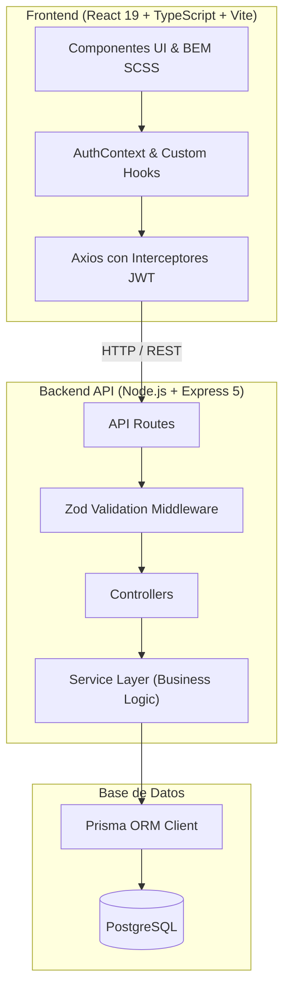
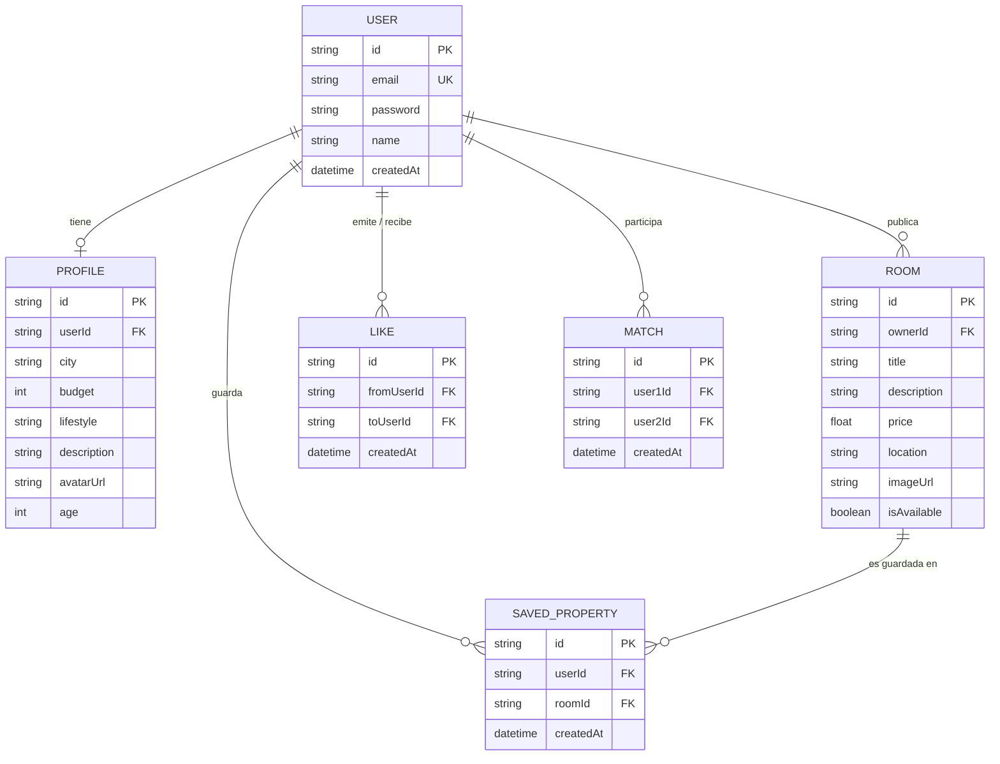

# Match-Live 🏠✨

> **«Primero personas, luego piso»** — Plataforma Fullstack de convivencia y emparejamiento de compañeros de piso (*Roommate Matching*).

[](https://github.com)
[](https://react.dev/)
[](https://www.typescriptlang.org/)
[](https://nodejs.org/)
[](https://www.postgresql.org/)
[](https://www.docker.com/)

---

## 🎯 Visión y Propuesta de Valor

Los portales inmobiliarios tradicionales priorizan los metros cuadrados y el precio, ignorando el factor determinante para una convivencia exitosa: **la afinidad entre las personas**.

**Match-Live** invierte el proceso convencional:
1. **Conoce a tus compañeros primero**: Explora perfiles con hábitos, horarios, estilo de vida y rangos de presupuesto.
2. **Match por reciprocidad**: Al indicar interés por un perfil, el sistema comprueba la reciprocidad para formalizar una conexión.
3. **Desbloqueo de habitaciones**: Una vez confirmada la afinidad, se desbloquean las habitaciones compatibles para visitar y alquilar conjuntamente.
4. **Comunicación contextual**: Chat directo enfocado en la vivienda compartida seleccionada.

---

## 🏗️ Arquitectura del Sistema

La solución está construida sobre una arquitectura desacoplada **Fullstack PERN** con tipado estricto de extremo a extremo:



---

## 🗄️ Modelo de Datos Relacional

Diseñado en **PostgreSQL** mediante **Prisma ORM**, estructurando usuarios, estilos de vida, viviendas, favoritos y emparejamiento recíproco:



---

## 💻 Decisiones Técnicas Destacadas

* **Capa de Servicios Limpia (Clean Architecture)**: Desacoplamiento total entre controladores HTTP y la lógica de negocio (`AuthService`, `MarketplaceService`, `RoomService`, `ProfileService`, `SavedService`, `MessageService`).
* **Mensajería y Chat Persistente en Base de Datos**: Endpoint REST para envío y recuperación de historial de mensajes contextualizados por vivienda y emparejamiento.
* **Validación en Runtime con Zod**: Esquemas tipados con validación estricta para payloads de entrada (registro, inicio de sesión, actualización de perfil, creación de inmuebles y envío de mensajes).
* **Autenticación Dual (Invitado / Usuario Registrado)**: El marketplace permite exploración libre a visitantes anónimos y activa la persistencia de likes/matches relacionales en PostgreSQL cuando el usuario inicia sesión.
* **Seguridad**: Cifrado unidireccional de contraseñas mediante `bcrypt` y sesiones stateless con JSON Web Tokens (`JWT`).
* **Design System & SCSS Modular**: Arquitectura de estilos estructurada bajo metodología BEM (`abstracts/`, `base/`, `components/`, `layout/`, `pages/`, `themes/`).

---

## 🚀 Puesta en Marcha en Local

### Prerrequisitos
* [Node.js](https://nodejs.org/) (versión 20 o superior recomendada)
* [Docker Desktop](https://www.docker.com/) o una instancia de PostgreSQL en ejecución

### 1. Clonar el repositorio
```bash
git clone https://github.com/elpronick/Match-Live.git
cd Match-Live
```

### 2. Iniciar la Base de Datos con Docker Compose
```bash
docker compose up -d
```
*(Esto levantará un contenedor de PostgreSQL en el puerto `5432` con volumen persistente).*

### 3. Configuración del Backend
```bash
cd backend
npm install

# Generar cliente de Prisma y sincronizar esquema
npx prisma db push

# Poblar la base de datos con usuarios y pisos de prueba
npx tsx prisma/seed.ts

# Iniciar servidor backend en desarrollo
npm run dev
```
El servidor backend se ejecutará en: `http://localhost:5000`

### 4. Configuración del Frontend
```bash
cd ../frontend
npm install

# Iniciar servidor de desarrollo con Vite
npm run dev
```
La aplicación web se ejecutará en: `http://localhost:5173`

---

## 👤 Credenciales de Demostración para Pruebas

Para evaluar la aplicación sin necesidad de registrar un nuevo usuario:

| Campo | Valor |
| :--- | :--- |
| **Email** | `demo@matchlive.com` |
| **Contraseña** | `123456` |
| **Perfil** | Usuario con perfil preconfigurado y match mutuo activo con *Laura García*. |

---

## 📂 Estructura del Proyecto

```text
Match-Live/
├── docker-compose.yml        # Configuración de PostgreSQL para desarrollo local
├── README.md                 # Documentación técnica del proyecto
├── backend/
│   ├── prisma/
│   │   ├── schema.prisma     # Definición del esquema de datos relacional
│   │   └── seed.ts           # Script de datos iniciales realistas
│   └── src/
│       ├── controllers/      # Controladores HTTP (REST)
│       ├── db/               # Conexión y cliente de Prisma ORM
│       ├── middlewares/      # JWT Auth y Validación con Zod
│       ├── routes/           # Rutas modulares de Express
│       ├── schemas/          # Esquemas de validación Zod
│       ├── services/         # Capa de lógica de negocio (Clean Code)
│       └── index.ts          # Punto de entrada del servidor
└── frontend/
    └── src/
        ├── api/              # Cliente HTTP Axios e interceptores
        ├── components/       # Componentes React (Deck, ChatModal, etc.)
        ├── context/          # Gestión de estado global (AuthContext)
        ├── hooks/            # Custom Hooks (useDeck, useSavedProperties)
        ├── pages/            # Vistas (HomePage, Dashboard, Login, etc.)
        └── styles/           # SCSS modular estructurado con metodología BEM
```
